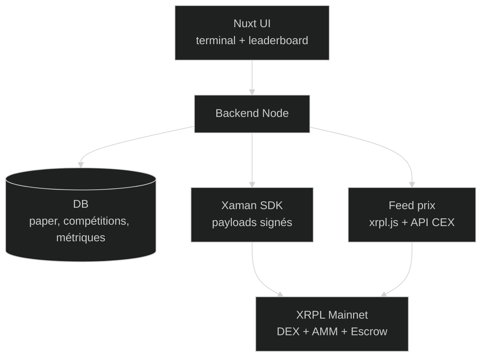
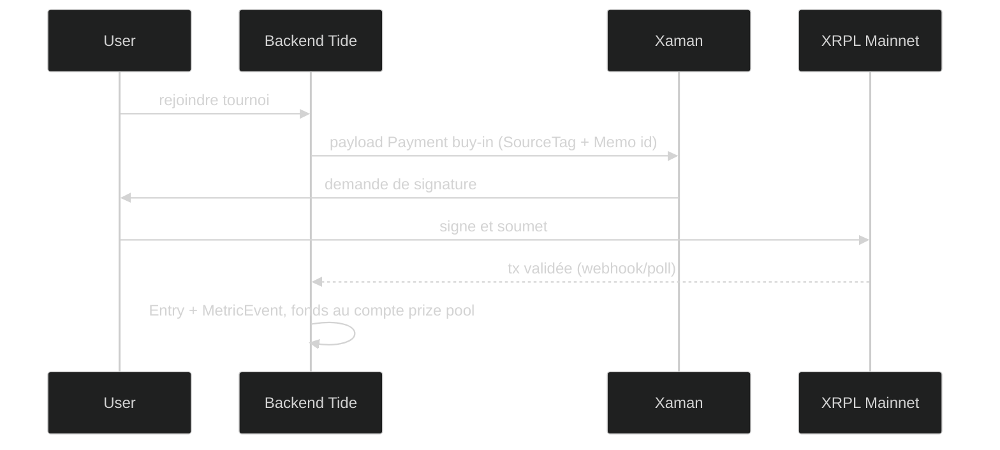
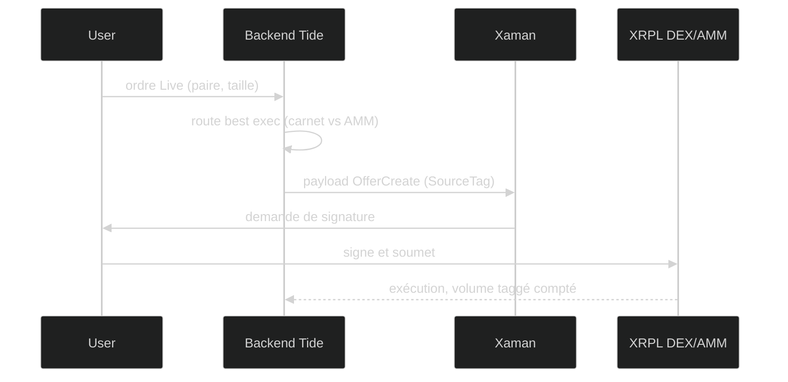

# Tide — Spec technique

> Statut : validée · Plateforme : XRPL Mainnet (L1) · Contexte : hackathon Make Waves XRPL, fin 2026-09-21 · Mis à jour : 2026-06-21
> Doc d'idée : note Obsidian `Hackathon/XRP/Make Waves XRPL — Tide` · Faisabilité : validée (voir §3 et `DEVLOG`)

Spec de référence pour coder Tide. Ne liste que des briques vérifiées en mainnet ; tout ce qui reste à trancher est en §10.

---

## 1. Vue d'ensemble

**Tide est un terrain d'entraînement au trading crypto : on apprend sans risque en paper trading, on prouve son edge dans des compétitions ancrées on-chain sur XRPL, puis on passe au trading réel en un clic.** Le simulateur attire la foule (métrique *users*), le trading réel fait le volume (métrique *volume*).

- **Pour qui** : étudiants et retail qui n'osent pas trader par peur de perdre.
- **Le pari** : un seul produit, deux modes (Paper / Live) qui partagent le même feed de prix, la même UI et le même leaderboard. La seule différence est le settlement (virtuel vs vraie transaction XRPL taggée). Ça divise le scope par deux et transforme le funnel en un simple bouton « passer en Live ».
- **Contexte** : hackathon 90 jours, app **live sur mainnet**, jugée sur de vrais users et du vrai volume mesurés on-chain via `SourceTag`. Pas de smart contract (inutile ici), donc tout tient sur des primitives natives + un backend off-chain.

**Décisions structurantes** (détail en §3 et §7) : pas de perp, pas de smart contract, pas d'oracle on-chain, pas d'EVM sidechain pour ce hack. Monétisation par **buy-in de tournoi** (rake), pas par fee sur les swaps.

---

## 2. Architecture

Un backend off-chain porte tout l'état (Paper, leaderboard, compétitions, métriques). Le L1 XRPL n'intervient que pour le Live et l'ancrage des inscriptions, via des transactions signées non-custodial par Xaman et taggées avec le `SourceTag` du projet.

Le feed de prix lit le carnet d'ordres et le spot AMM directement sur le L1, complété d'une API CEX pour le prix de référence des majors. Le même feed alimente la simulation Paper et l'affichage Live.

---

## 3. Primitives / amendements utilisés

Section clé : tout ce sur quoi Tide bâtit, avec son état réel en mainnet (juin 2026) et la source. **Aucun smart contract.**

| Primitive / standard | Rôle dans Tide | État | Source |
|---|---|---|---|
| DEX natif `OfferCreate` | Exécution des swaps spot en mode Live (carnet d'ordres) | ✅ mainnet (core protocol, pas d'amendment) | [OfferCreate](https://xrpl.org/docs/references/protocol/transactions/types/offercreate) · [Known amendments](https://xrpl.org/resources/known-amendments) |
| AMM — XLS-30 | Liquidité complémentaire au carnet pour la best execution | ✅ mainnet (amendment `AMM` enabled) | [Known amendments](https://xrpl.org/resources/known-amendments) |
| `SourceTag` | Attribution on-chain : c'est le compteur du hackathon (volume + comptes actifs) | ✅ mainnet (champ natif des tx) | [Source & Destination Tags](https://xrpl.org/docs/concepts/transactions/source-and-destination-tags) |
| `Memos` | Encoder l'inscription à un tournoi (id compétition) dans la tx de buy-in | ✅ mainnet (champ commun des tx) | [Transaction common fields](https://xrpl.org/docs/references/protocol/transactions/common-fields) |
| `Payment` | Buy-in de tournoi (user → compte prize pool) **et** payout vers chaque gagnant, taggés | ✅ mainnet (core protocol) | [Payment](https://xrpl.org/docs/references/protocol/transactions/types/payment) |
| Compte opérateur **multisig** (`SignerListSet`) | Détenir les buy-ins d'un tournoi et payer les gagnants par `Payment` | ✅ mainnet (core protocol) | [Multi-signing](https://xrpl.org/docs/concepts/accounts/multi-signing) |
| Xaman (XUMM SDK) | Signature non-custodial : payload = template de tx XRPL, l'user signe | ✅ prod (SDK accepte `SourceTag`/`Memos`) | [Xaman payloads](https://docs.xaman.dev/concepts/payloads-sign-requests) |
| RLUSD | Paire liquide prioritaire pour le routing Live | ✅ mainnet (stablecoin émis) | [xrpl.to](https://xrpl.to/) |

> **Escrow natif écarté pour le prize pool.** Un `Escrow` XRPL a **une destination unique fixée à la création** : il ne peut pas distribuer aux N gagnants d'un tournoi ([Escrow](https://xrpl.org/docs/concepts/payment-types/escrow)). Le prize pool est donc détenu par un **compte opérateur multisig** qui paie chaque gagnant via un `Payment`. (Le TokenEscrow existe pour les tokens mais exige le flag `Allow Trust Line Locking` côté émetteur — non garanti pour RLUSD — raison de plus de ne pas s'en servir.)

**Écartés (et pourquoi), pour ne pas les réintroduire par erreur :**

| Brique | État | Décision |
|---|---|---|
| PriceOracle XLS-47 | ✅ activé mainnet | **Non utilisé** : un oracle on-chain ne sert qu'à un smart contract qui lit le prix ; Tide n'en a aucun. Feed de prix off-chain à la place. [XLS-47](https://github.com/XRPLF/XRPL-Standards/tree/master/XLS-0047-PriceOracles) |
| Smart contracts natifs XLS-100/101 | ❌ devnet, ~2027+ | Indisponible en mainnet → exclu. [Known amendments](https://xrpl.org/resources/known-amendments) |
| `Batch` (atomicité multi-tx) | ❌ désactivé (bug), `BatchV1_1` à venir | **Ne pas dépendre d'atomicité multi-tx** : buy-in et premier trade sont des tx indépendantes. [Known amendments](https://xrpl.org/resources/known-amendments) |
| Perp / dérivés | ❌ (besoin de smart contracts) | Hors scope. Contradiction de branding (« apprendre » vs levier). v2 sidechain. |
| EVM Sidechain | ✅ mainnet (30 juin 2025) | **Écarté pour le hack** : chaîne séparée → l'activité ne remonte pas au `SourceTag` du L1 (perte des métriques), liquidité à amorcer, bridge en friction. v2 post-hack. [XRPL EVM mainnet](https://ripple.com/insights/xrpl-evm-sidechain-mainnet-is-live/) · [XRPL sidechains](https://xrpl.org/docs/concepts/xrpl-sidechains) |

---

## 4. Stack

| Couche | Choix | Pourquoi |
|---|---|---|
| Frontend | Nuxt + TypeScript | Zone de confort d'Armand ; terminal de trading + leaderboard + compétitions |
| Backend | Node + TypeScript + DB (Postgres ou SQLite) | État Paper, portefeuilles virtuels, leaderboard, compétitions, suivi des métriques taggées |
| XRPL | `xrpl.js` | Lib officielle : construire `OfferCreate`/`Payment` (avec `SourceTag`/`Memos`), lire carnet + pools AMM, suivre les tx taggées |
| Wallet / signature | Xaman (XUMM SDK) | Signature non-custodial, payloads = templates de tx, onboarding sans signup email |
| Feed de prix | `xrpl.js` (on-chain) + API CEX (CoinGecko/Binance) | Spot AMM + carnet pour les paires XRPL ; CEX pour le prix de référence des majors. Aucun oracle on-chain |
| Moteur de volume (option) | Base du bot MM/arb **Diaso** adaptée XRPL, taggée | Réutilise un asset existant ; edge à valider (§9, §10) |
| Data tokens | xrpl.to / XPMarket / XRPSCAN | Métadonnées et liquidité des tokens |

**Conventions** (cf. `~/.claude/CLAUDE.md`) : TS strict, jamais `as any` ; modules cohérents (un module = une responsabilité) ; pas de valeurs magiques ; valider toutes les entrées critiques (montants, adresses, paramètres de tx).

---

## 5. Modèle de données

Frontière nette : **le Paper et toute la logique applicative vivent off-chain (DB)** ; **seuls le Live et l'ancrage des inscriptions vivent on-chain (XRPL)**.

**Off-chain (DB) :**
- `User` — identité = adresse XRPL (connexion Xaman), pas d'email. Profil, date d'activation.
- `PaperWallet` — solde virtuel par user, devises, valeur de départ.
- `PaperOrder` — ordre simulé : paire, sens, taille, prix d'exécution (snapshot du feed réel), timestamp.
- `Competition` — tournoi : id, buy-in, règles, fenêtre, état (ouvert/en cours/clos), `escrow_seq` du prize pool.
- `Entry` — inscription d'un user à un tournoi, hash de la tx de buy-in, `SourceTag`/`Memo` associés.
- `LeaderboardSnapshot` — classements calculés (PnL Paper, perf Live).
- `MetricEvent` — chaque tx taggée observée on-chain (type, montant, user) pour suivre volume et comptes actifs distincts.

**On-chain (XRPL) :**
- Transactions `Payment` de buy-in (taggées `SourceTag` + `Memos`), vers le compte prize pool.
- Transactions `OfferCreate` du mode Live (taggées `SourceTag`).
- **Compte opérateur multisig** par tournoi (ou unique avec compta off-chain par tournoi) détenant les buy-ins ; payouts gagnants par `Payment`.

> Le mode Paper ne produit **aucune** écriture on-chain : un joueur ne devient « compte actif » qu'en signant une vraie tx (buy-in ou trade Live). C'est volontaire (cf. §10, définition « active account » à confirmer orga).

---

## 6. Flux techniques

### 6.1 Rejoindre un tournoi (ancrage on-chain + activation)

L'inscription est la transaction qui transforme un joueur Paper en compte actif et alimente le prize pool.

### 6.2 Passer en Live (swap spot taggé)

### 6.3 Clôture et distribution du prize pool

À la fin du tournoi : le backend calcule le classement (off-chain), puis l'**opérateur signe (multisig) un `Payment` taggé vers chaque gagnant**, moins le rake. La distribution est **semi-custodiale** : entre le buy-in et le payout, les fonds sont réellement détenus par le compte opérateur (pas d'Escrow possible vers plusieurs destinataires, et pas de logique conditionnelle on-chain sans smart contract). Le multisig borne le risque ; l'exposition est limitée au montant des cagnottes en cours.

---

## 7. Sécurité / custody

- **Non-custodial sur les fonds de trading** : Tide ne détient jamais les clés ni les fonds de trading des users. Chaque action Live est un payload signé par l'user dans Xaman.
- **Semi-custodial sur les prize pools uniquement** : les buy-ins sont détenus par un **compte opérateur multisig** (l'Escrow natif ne peut pas payer plusieurs gagnants, cf. §3). C'est une vraie custody, bornée au montant des cagnottes en cours. Mitigations : **multisig dès le MVP** (pas de clé unique), montants de buy-in faibles au début, clôture rapide des tournois. À cadrer côté UX (afficher que la cagnotte est custodiale le temps du tournoi).
- **Validation stricte des tx** : montants, adresses, devises et `SourceTag` vérifiés côté backend avant de générer un payload ; jamais de montant ou de destination non validés (cf. conventions Armand).
- **Anti-sybil** : 300 comptes actifs doivent être de vraies personnes (réseau étudiant), pas des wallets créés en masse. Le buy-in (coût réel) est un filtre anti-sybil naturel.
- **Pas de secret en clair** : clés d'API CEX, clé opérateur et secrets Xaman hors du repo (`.env`, jamais commit).
- **Honnêteté du track record Paper** : pas de slippage ni de psychologie de l'argent réel → cadré comme « engagement + apprentissage », la valeur sérieuse vient du Live vérifiable. À refléter dans l'UI (ne pas survendre la perf Paper).

---

## 8. Roadmap

| Phase | Période | Livrable | Dans le MVP ? |
|---|---|---|---|
| 0 — Setup & preuve | sem. 1-2 · 22 juin → 5 juil | Inscription, réserver le `SourceTag`, poser les questions orga (§10). Prototype « hello world » : Xaman + **1 swap taggé en mainnet** pour vérifier que l'attribution monte au compteur. Brancher le feed de prix off-chain. Design UI (un terminal, deux modes). | oui |
| 1 — MVP Paper + compétitions | sem. 3-4 · 6 → 20 juil *(avant deadline inscription 21 juil)* | Mode Paper (portefeuille virtuel, ordres simulés sur prix réels, PnL). Leaderboard + moteur de compétitions. **Ancrage on-chain** : rejoindre une compétition = `Payment` de buy-in taggé. | oui |
| 2 — Mode Live | sem. 5-7 · 21 juil → 10 août | Mode Live spot via DEX natif signé Xaman et taggé + bouton « passer en Live ». Best execution basique (AMM + carnet) sur 2-3 paires liquides dont RLUSD. 1re compétition publique. | oui |
| 3 — Acquisition & volume | sem. 8-10 · 11 → 31 août | Compétitions étudiantes (ESILV, DVB, écoles partenaires). Funnel paper→live ciblé sur les top joueurs (rebates). Bot arb/MM taggé en arrière-plan **si self-généré compté** (§10). | partiel |
| 4 — Scaling & pitch | sem. 11-13 · 1 → 21 sept | Pousser users (referral, viralité du track record) et volume (whales, RLUSD). Polish + pitch jury. | non |

**Coupé du MVP :** perp/dérivés, oracle on-chain, EVM sidechain, smart contracts, backtest engine, multi-chain, fiat on-ramp, mobile natif, design léché, atomicité multi-tx (Batch). Focus : une démo qui marche + des métriques qui montent.

---

## 9. Risques techniques & mitigations

| Risque | Impact | Mitigation |
|---|---|---|
| Conversion paper → live faible (users sans capital / frileux) | Volume insuffisant → rate Most Volume | Cibler l'élite (top joueurs), rebates/incentives, ne pas chercher à convertir tout le monde |
| Marché spot XRPL petit | Difficile de drainer du volume | Concours **relatif**, barre basse ; intégrer RLUSD ; cibler quelques whales > beaucoup de petits |
| Volume self-généré coûteux (spread + frais AMM) | Wash-trading à perte | Ne jouer que sur un arb réellement rentable, validé en petite taille (skills `quant-mentor`/`strat-audit`) |
| Métriques creuses / sybil | 300 « comptes » sans vraies personnes | Buy-in payant = coût réel anti-sybil ; réseau étudiant garantit du vrai |
| Clé opérateur du prize pool compromise | Vol des cagnottes en cours | **Multisig dès le MVP** (pas de clé unique), buy-ins faibles au début, clôture rapide, exposition bornée aux cagnottes en cours |
| Onboarding d'un user totalement nouveau | Pour signer un buy-in / trade, il faut un **compte XRPL activé et financé** (réserve de base en XRP + frais) → friction | Le Paper ne demande rien (pas de tx) ; expliquer la réserve au moment de passer en Live/buy-in ; viser un public qui a déjà un peu de XRP, ou prévoir un petit faucet/parrainage |
| Dépendance feed CEX (rate limit / panne) | Prix Paper figé | Double source (CEX + spot AMM on-chain), cache, dégradation gracieuse |

---

## 10. Décisions ouvertes / à valider

Questions à l'orga (kickoff 22 juin) et tests à faire — rien n'est comblé par une affirmation.

- [ ] **Définition d'un « active account »** : 1 tx suffit-elle ? Une tx `Memo` sans transfert de valeur compte-t-elle ? Comptes distincts ? Sur quelle période ? → décide si le buy-in est le bon véhicule d'activation.
- [ ] **Volume self-généré compté ?** (mon arb/MM, brique optionnelle) → conditionne tout le moteur de volume (Phase 3).
- [ ] **Activité EVM Sidechain comptée** pour Most Volume / Most Users / 300 Active ? (hypothèse : non) → confirme l'exclusion du sidechain.
- [ ] **Le `SourceTag` est-il le seul moyen d'attribution**, ou existe-t-il un enregistrement d'app/wallet ?
- [ ] **Test mainnet Phase 0** : vérifier de mes yeux qu'un `OfferCreate` taggé incrémente bien le compteur d'attribution du hackathon.
- [ ] **Couverture des paires liquides** pour la best execution (au-delà de XRP/RLUSD) à mesurer sur xrpl.to/XPMarket.
- [ ] **Multisig** du compte prize pool : un compte par tournoi ou un compte unique avec compta off-chain ? Quel quorum de signataires ? (tranché : multisig dès le MVP, reste à définir la topologie)
- [ ] **Buy-in en RLUSD ou en XRP ?** Si RLUSD (token), simple `Payment` vers le compte pool (pas d'Escrow) ; vérifier l'UX trustline. Si XRP, attention à la réserve de compte.
